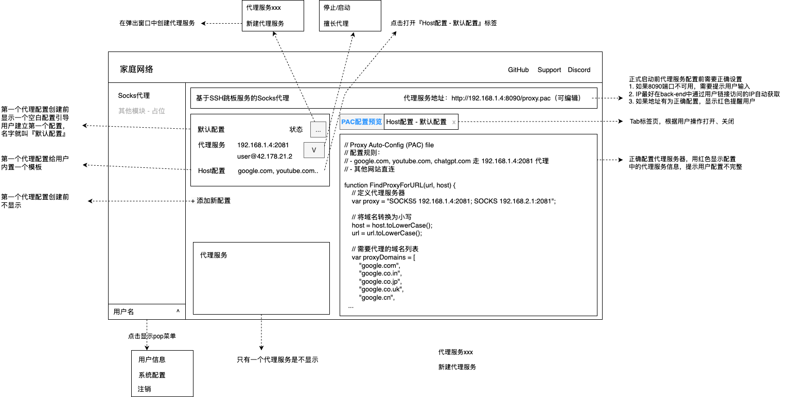

# 项目目标

- 本项目的目标是开发"一键构建代理服务器docker"工具。整体架构图如下。图中描述了项目开发的整体结构以及两个开发阶段。
- 用户可以通过两种方式意见搭建socks代理服务
  - build.sh - 通过Dockerfile本地构建镜像、容器
  - sudo docker run -d xxx - 拉取已经构建好的镜像直接创建容器
- 代理服务器docker提供代理管理服务
  - 代理管理服务管理下面基本信息：
    - 代理服务：用户可以创建、删除代理服务。
    - Host代理配置：用户可以创建、擅长Host配置。每个Host配置指定哪些host通过那个代理服务访问。不同Host配置中的host不能重叠, 包装一个host只会被一个代理服务代理，避免歧义
    - 系统配置：账号注册开关，默认是开启，方便用自助服务。
  - 用户注册可以即可登录
    - 所有用户都有完全的配置权限
    - 用户可以管理自己的信息，修改自己的密码
  - 代理服务、Host代理配置、PAC配置的关系
    - 代理服务、Host代理配置两个独立的信息。
      - 代理服务只用来封装跳板服务
      - Host代理配置用来配置(host、代理服务)的关系。如果用户有访问某个网络的两个跳板服务，用户客户配置两个代理服务，根据需要为同一组host切换代理服务，提供更好的代理服务能力
      - 一个Host代理配置只能使用一个代理服务
      - 一个代理服务可以被多个
    - 最终的PAC代理配置基于Host代理配置生产
    - 通常用户只有一个代理服务，UI设计上要兼顾方便性、灵活性
      - 方便性：用户创建一个代理服务时，自动创建一个Host代理配置，这个代理Host配置使用这个代理服务
      - 灵活性：用户可以为Host配置添加一个新的代理服务（走创建代理服务流程），这个Host代理配置使用的代理服务自动切换到这个代理服务
- docker容器体积尽量小，方便部署在小的linux盒子上
- 支持x86、arm64 docker
- 所有服务，包括nginx、代理管理服务都部署在一个docker容器中
- 技术方案选型方案总体架构图中已经描述，如下
  - 代理配置后端(back-end)：node.js
  - 代理配置前端(frond-end))：node.js + vue3 + element plus
  - 代理服务：通过autossh建立稳定ssh -D代理服务
- 前端UI风格
  - 专业、科技风格，类似google ai studio的设计风格
  - 采用Material Design设计，平面风格，不要用采用阴影设计
- 代理服务全全局参数（用户在系统配置中维护）
  - 注册账号开关

# 总结架构设计如下

# 前端UI框架示意图如下

# 开发步骤

分两阶段完成构建代理服务docker

1. 第一阶段：在本地开发代理服务，包括front-end、back-end，产物包括：
   - server/front-end         - 前端项目
   - server/back-end中      - 后端项目
2. 第二阶段：构建Docker容器，产物包括-
   * Dockerfile                    - 创建docker镜像，将前后端代码打包到容器中，并且安装所有组件构建容器
   * build.sh                        - 构建docker容器，需要用户设置代理服务地址信息（host（默认本ip）)、port（默认8090）))

